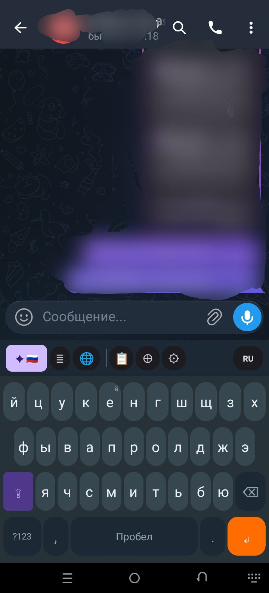
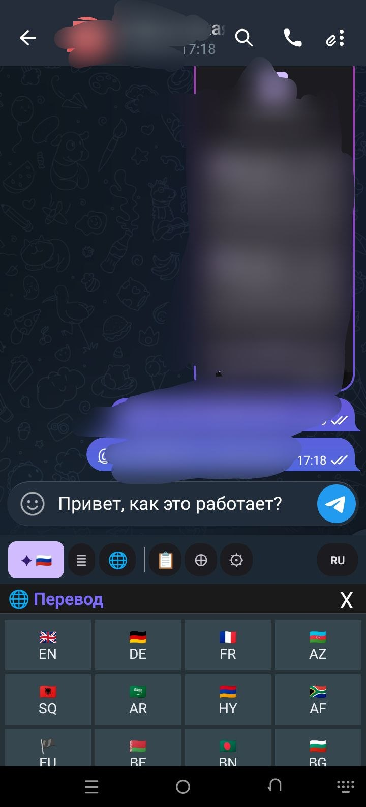

<div align="center">

<br><br>

<picture>
  
</picture>

<br><br>

# 「 TAJKEYBOARD AI 」

### ⌨️ Умная клавиатура нового поколения с искусственным интеллектом

<br>

*Печатай быстрее · Пиши грамотнее · Общайся на любом языке · Переводи мгновенно*

<br>

<a href="https://github.com/Khudoidod-dev/TAJKEYBOARD-AI/releases/latest"></a>
&nbsp;
<a href="https://t.me/TAJGROUP_License_bot"></a>
&nbsp;
<a href="https://tajgroup.ru"></a>

<br><br>

&nbsp;
&nbsp;
&nbsp;
&nbsp;
&nbsp;
&nbsp;


<br><br>

---

<br>

### 📸 Скриншоты

<br>

&nbsp;&nbsp;&nbsp;
&nbsp;&nbsp;&nbsp;


<sub>⌨️ Клавиатура&nbsp;&nbsp;&nbsp;&nbsp;&nbsp;&nbsp;&nbsp;&nbsp;&nbsp;&nbsp;&nbsp;&nbsp;&nbsp;&nbsp;&nbsp;&nbsp;&nbsp;&nbsp;&nbsp;&nbsp;&nbsp;&nbsp;&nbsp;&nbsp;&nbsp;🔐 Личный кабинет&nbsp;&nbsp;&nbsp;&nbsp;&nbsp;&nbsp;&nbsp;&nbsp;&nbsp;&nbsp;&nbsp;&nbsp;&nbsp;&nbsp;&nbsp;&nbsp;&nbsp;&nbsp;&nbsp;&nbsp;&nbsp;&nbsp;🌐 Перевод</sub>

<br><br>

---

<br>

### 🌍 Поддержка 11 языков и раскладок

<br>

&nbsp;&nbsp;
&nbsp;&nbsp;
&nbsp;&nbsp;
&nbsp;&nbsp;
&nbsp;&nbsp;
&nbsp;&nbsp;
&nbsp;&nbsp;
&nbsp;&nbsp;
&nbsp;&nbsp;
&nbsp;&nbsp;


<br><br>

| Флаг | Язык | Раскладка | T9 Словарь |
|:----:|------|-----------|:----------:|
| 🇷🇺 | Русский | ЙЦУКЕН | ✅ ~400 слов |
| 🇬🇧 | English | QWERTY | ✅ ~250 слов |
| 🇹🇯 | Тоҷикӣ | Тоҷикӣ | ✅ ~150 слов |
| 🇺🇦 | Українська | ЙЦУКЕН | ⬜ |
| 🇩🇪 | Deutsch | QWERTZ | ⬜ |
| 🇫🇷 | Français | AZERTY | ⬜ |
| 🇪🇸 | Español | QWERTY | ⬜ |
| 🇹🇷 | Türkçe | QWERTY-TR | ⬜ |
| 🇵🇱 | Polski | QWERTY-PL | ⬜ |
| 🇰🇿 | Қазақша | ЙЦУКЕН-KZ | ⬜ |
| 🇺🇿 | O'zbek | QWERTY-UZ | ⬜ |

<sub>✅ — встроенный словарь для офлайн-подсказок T9 · ⬜ — только раскладка (подсказки через AI онлайн)</sub>

<br>

---

</div>

<br>

## ⚡ Подробное описание возможностей

<br>

### ✦ ИИ-исправление ошибок

Нажмите кнопку **✦ AI** на панели клавиатуры — и весь набранный текст мгновенно исправляется:

- **Орфография** — опечатки, пропущенные буквы, неправильные буквы
- **Грамматика** — согласование, падежи, времена глаголов
- **Пунктуация** — запятые, точки, вопросительные знаки, тире
- **Стиль** — учитывает выбранный тон (нейтральный/формальный/разговорный/краткий)

Работает на всех поддерживаемых языках. Исправление происходит за 1-3 секунды. Если выделен фрагмент текста — исправляется только он.

<br>

### ≣ Перефразирование текста

Кнопка **≣** предлагает 3 варианта перефразирования вашего текста с сохранением смысла:

| Стиль | Описание | Пример |
|-------|----------|--------|
| 📝 Формальный | Деловой, профессиональный тон | Для писем, документов, резюме |
| 💬 Разговорный | Дружеский, лёгкий тон | Для чатов, соцсетей, сообщений |
| ⚡ Краткий | Лаконичный, по сути | Для заметок, SMS, быстрых ответов |

Нажмите на понравившийся вариант — и он вставится вместо исходного текста.

<br>

### 🌐 Мгновенный перевод

Переводите текст прямо в клавиатуре, не покидая приложение:

- Нажмите **🌐** на панели AI
- Выберите язык перевода (флаг страны)
- Перевод появится за 1-2 секунды
- Нажмите на результат — он вставится в поле ввода

Не нужно открывать Google Translate или копировать текст. Всё происходит прямо в клавиатуре.

<br>

### 💡 Умные подсказки (T9 + AI)

Двойная система подсказок при наборе:

**Офлайн T9 (словарь):**
- Работает без интернета
- ~800 слов на русском, английском и таджикском
- Подсказки появляются после 2 символов
- Нажмите на подсказку для вставки

**AI-продолжение (онлайн):**
- Предлагает продолжение целых фраз
- Учитывает контекст всего предложения
- 3 варианта продолжения
- Требует подключение к интернету

Режим выбирается в настройках: Выкл / Словарь / AI.

<br>

### 🎨 9 тем оформления

| Тема | Стиль |
|------|-------|
| Material | Стандартная Material Design 3 |
| Тёмная | Тёмные тона, мягкий контраст |
| AMOLED | Чисто чёрный фон, экономит батарею |
| Gboard | Стиль Google Gboard |
| Samsung | Стиль Samsung Keyboard |
| SwiftKey | Стиль Microsoft SwiftKey |
| Синяя | Синий акцент |
| Зелёная | Зелёный акцент |
| Океан | Тёмно-синие тона |

<br>

### 📋 Буфер обмена

Встроенный менеджер буфера обмена:

- 📜 **История** — все скопированные тексты сохраняются
- 📌 **Закрепление** — важные записи не удаляются
- ⚡ **Быстрая вставка** — нажмите на запись для вставки
- 🗑 **Удаление** — удаляйте ненужные записи
- ✏️ **Добавление** — сохраняйте текущий текст в буфер

<br>

### 😀 Эмодзи

Полноценная панель эмодзи:

- Категории: 😀 Лица · 👋 Жесты · 🐱 Животные · 🍎 Еда · ⚽ Спорт · 🚗 Транспорт · 💡 Предметы · ❤️ Символы
- Быстрый доступ через кнопку на клавиатуре
- Кнопка «ABC» для возврата к буквам

<br>

### 🔐 Личный кабинет

Система аккаунтов и лицензий:

- 👤 **Профиль** — роль, ключ, срок действия
- 📊 **Статистика** — сколько раз использовали ИИ
- 🔗 **Реферальный код** — пригласите друга и получите бонус
- ⚙️ **ИИ настройки** — язык AI, тон исправления
- 🛡 **Админ-панель** — только для администраторов

<br>

### 🔧 Дополнительные функции

- ↩️ **Отмена/Возврат** — отмените последнее действие
- 🎲 **Генератор текста** — генерация текста по запросу
- 🔒 **Генератор паролей** — надёжные пароли одним нажатием
- ← → **Управление курсором** — перемещение курсора кнопками
- 🔍 **Поиск** — быстрый поиск

<br>

---

## 📲 Установка — пошаговая инструкция

<br>

### Шаг 1: Скачайте APK

Нажмите кнопку **«Скачать APK»** вверху страницы или скачайте из [Releases](https://github.com/Khudoidod-dev/TAJKEYBOARD-AI/releases).

### Шаг 2: Установите

Откройте скачанный файл. Если Android просит разрешение — нажмите «Установить из неизвестных источников».

### Шаг 3: Включите клавиатуру

```
Настройки Android → Язык и ввод → Управление клавиатурами → TAJKEYBOARD AI → ВКЛ
```

### Шаг 4: Выберите по умолчанию

Откройте любое приложение с полем ввода, нажмите на поле и выберите TAJKEYBOARD AI из списка клавиатур.

### Шаг 5: Готово! ✓

Клавиатура установлена. Для ИИ-функций активируйте ключ (см. ниже).

<br>

---

## 🔑 Активация ИИ-функций — подробная инструкция

<br>

**Что работает без ключа (бесплатно):**
- ✅ Все раскладки (11 языков)
- ✅ T9 офлайн (словарь)
- ✅ Эмодзи
- ✅ Буфер обмена
- ✅ Все темы
- ✅ Настройки клавиатуры

**Что требует ключ:**
- 🔑 ✦ ИИ-исправление
- 🔑 ≣ Перефразирование
- 🔑 🌐 Перевод
- 🔑 💡 AI-подсказки (онлайн-режим)

<br>

### Как получить ключ:

```
1. Откройте Telegram
2. Найдите бота: @TAJGROUP_License_bot
3. Нажмите /start
4. Нажмите «Получить ключ»
5. Выберите «Клавиатура AI»
6. Подпишитесь на канал @tajgroup_ru и группу @tajgroup_chat
7. Получите ключ: XXXX-XXXX-XXXX-XXXX
```

### Как ввести ключ:

```
1. Откройте TAJKEYBOARD AI
2. Нажмите «Настройки»
3. Нажмите «Личный кабинет»
4. Введите ключ в поле
5. Нажмите «Войти»
6. ИИ-функции активированы! ✓
```

<br>

---

## 🔒 Приватность и безопасность

| | Гарантия |
|:---:|---|
| ✅ | Клавиатура **НЕ собирает** и **НЕ сохраняет** набранный текст |
| ✅ | ИИ-запросы отправляются **только** при нажатии кнопок AI |
| ✅ | Офлайн-функции работают **без интернета** |
| ✅ | Лицензионный ключ **привязан к устройству** |
| ✅ | Все данные хранятся **локально** на устройстве |
| ✅ | Приложение **не имеет доступа** к вашим контактам, файлам, камере |
| ✅ | Используется **HTTPS** для всех сетевых запросов |

<br>

---

## 🛠 Технические характеристики

```yaml
Платформа:        Android
Min SDK:          26 (Android 8.0 Oreo)
Target SDK:       34 (Android 14)
Язык:             Kotlin
AI движок:        LLM (облачный API)
Сетевой клиент:   OkHttp 4.12
UI фреймворк:     Material 3
Архитектура:      InputMethodService + Kotlin Coroutines
Размер APK:       ~10 MB
Офлайн словарь:   ~800 слов (RU ~400, EN ~250, TJ ~150)
Раскладки:        11 языков
Темы:             9 вариантов
Лицензия:         Proprietary (TAJGROUP)
```

<br>

---

## ❓ FAQ — Часто задаваемые вопросы

<details>
<summary><b>Клавиатура бесплатная?</b></summary>
<br>
Да, базовые функции (раскладки, T9, эмодзи, буфер, темы) бесплатны навсегда. ИИ-функции требуют ключ активации который выдаётся через Telegram бота.
</details>

<details>
<summary><b>Нужен интернет?</b></summary>
<br>
Для печати, T9 офлайн, эмодзи и буфера — нет. Для ИИ-функций (исправление, перефраз, перевод) — да, нужен интернет.
</details>

<details>
<summary><b>Клавиатура следит за мной?</b></summary>
<br>
Нет. Приложение не собирает набранный текст и не отправляет его на серверы. ИИ-запросы отправляются только когда вы нажимаете кнопку AI.
</details>

<details>
<summary><b>Можно использовать на нескольких телефонах?</b></summary>
<br>
Один ключ привязывается к одному устройству. Для второго телефона нужен отдельный ключ.
</details>

<details>
<summary><b>Что делать если ключ просрочился?</b></summary>
<br>
Обратитесь к боту @TAJGROUP_License_bot для получения нового ключа. Базовые функции клавиатуры продолжают работать без ключа.
</details>

<details>
<summary><b>Какие модели телефонов поддерживаются?</b></summary>
<br>
Любой Android-телефон с версией 8.0 (Oreo) и выше. Samsung, Xiaomi, Huawei, Realme, OPPO, Vivo, Google Pixel — все.
</details>

<details>
<summary><b>Как переключить язык?</b></summary>
<br>
Нажмите кнопку «RU» / «EN» на панели клавиатуры или свайпните по пробелу влево/вправо.
</details>

<br>

---

## 📋 Changelog

### v1.0.0 (Июнь 2026)
- 🎉 Первый публичный релиз
- ✦ ИИ-исправление ошибок
- ≣ Перефразирование (3 стиля)
- 🌐 Мгновенный перевод (11 языков)
- 💡 T9 офлайн + AI-подсказки
- 🎨 9 тем оформления
- 📋 Буфер обмена с историей
- 😀 Эмодзи панель
- 🔐 Личный кабинет с лицензиями
- 🌍 11 раскладок

<br>

---

<div align="center">

<br>

### 📞 Контакты

<a href="https://tajgroup.ru"></a>
&nbsp;
<a href="https://t.me/TAJGROUP_License_bot"></a>
&nbsp;
<a href="https://t.me/tajgroup_ru"></a>
&nbsp;
<a href="https://t.me/tajgroup_chat"></a>

<br><br>

---

<br>


<br><br>

<sub>© 2024–2026 <b>TAJGROUP</b> · Все права защищены · <a href="https://tajgroup.ru">tajgroup.ru</a></sub>

<br><br>

</div>
